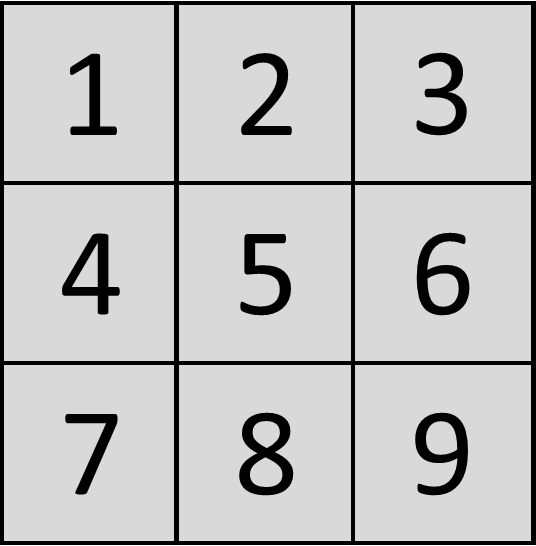
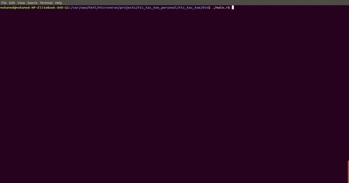
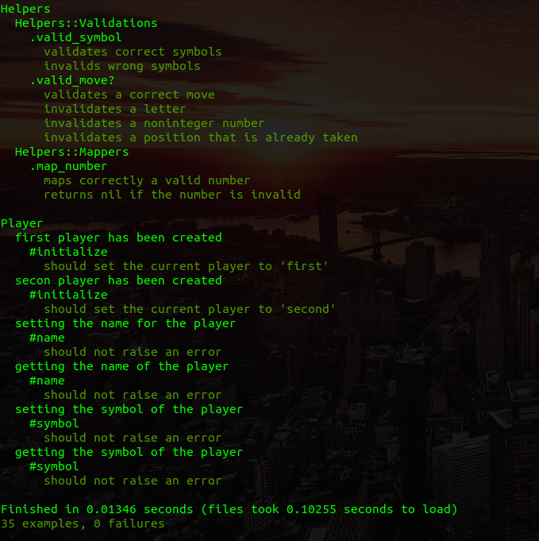

# Tic Tac Toe game

For a throughout description of the game you can read [this article from wikipedia](https://en.wikipedia.org/wiki/Tic-tac-toe). Altough you don't have to, **we cover the basic instructions here**. Welcome!


## Game instructions

1. The first player chooses a symbol, X or O. The other player has assigned the remaining option.
2. The board is built as a sucession of ascending numbers that start from 1 through 9, the following image represents the board positions.



3. By turns, pick a position at the board.
4. The player who succeeds in placing three of their symbols in either a horizontal, vertical, or diagonal row wins the game. The following image shows a win scenario for the O player.


## Authors

This project was executed by the duo of:

- [Mohamed Naser](https://www.linkedin.com/in/mohamednaseramein/)
- [Santiago Rodríguez](https://www.linkedin.com/in/santiago-andrés-308a5b190)

## Used tools

- Ruby

## Demo



## Setup

Inside your terminal, type the following instructions. Make sure to be in a directory where you have permissions to create files.

```console
$ git clone https://github.com/santiago-rodrig/tic_tac_toe.git
$ cd tic_tac_toe
$ ./bin/main.rb
```

If the last command fails then the `main.rb` file is not executable (though it should). Type this in your terminal (note that the `#` means the command __should be executed as root__).

```console
# chmod a+x  main.rb
```
## Testinf
go to the main folder and run 
```console
$ rspec
```

You will see something like that 



## Bug Reporting 

If you have any issue, request, or suggestion, post it [here](https://github.com/santiago-rodrig/tic_tac_toe/issues).

### Note apart

This project exists thanks to the [Microverse program](https://www.microverse.org/), that teaches people from all around the world how to become a software developer. If you're interested take a spin at their website.
